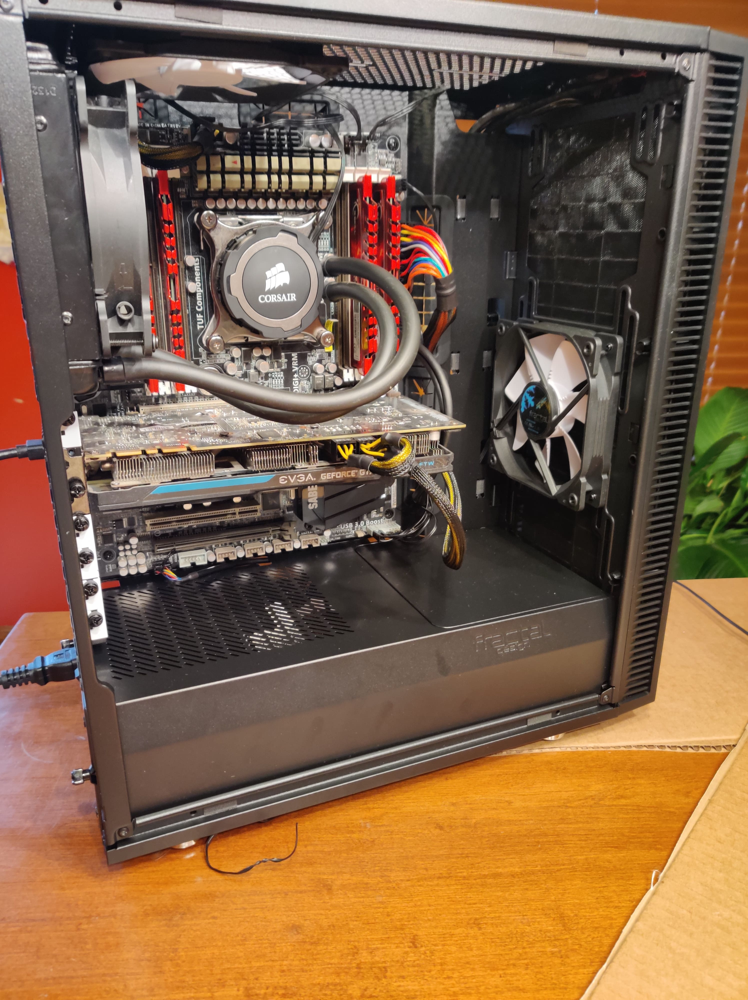

# Hello Internet!

 

This is my first blog post that will showcase my local data server/homelab that I have built from parts
collected over the years.

I will include a picture showcasing the build itself, which makes use of my old X79 machine
that has served me well since 2012 when I first built it.

 

## The build

----

Here I will list the server's components, which are subject to change as time marches on:

- CPU --> i7-4820k
- Motherboard --> Asus Sabertooth X79
- GPU --> GTX 770
- RAM --> 16GB DDR3 (This will change)
- Drives --> Boot & 8TB Storage
- Case --> Fractal Design

 

## Picture

----

*Beast-Server*

 

## Closing Remarks

----

I have already started to self host virtual machines with cool software within them.

More will come in the near future!

**CMIV**